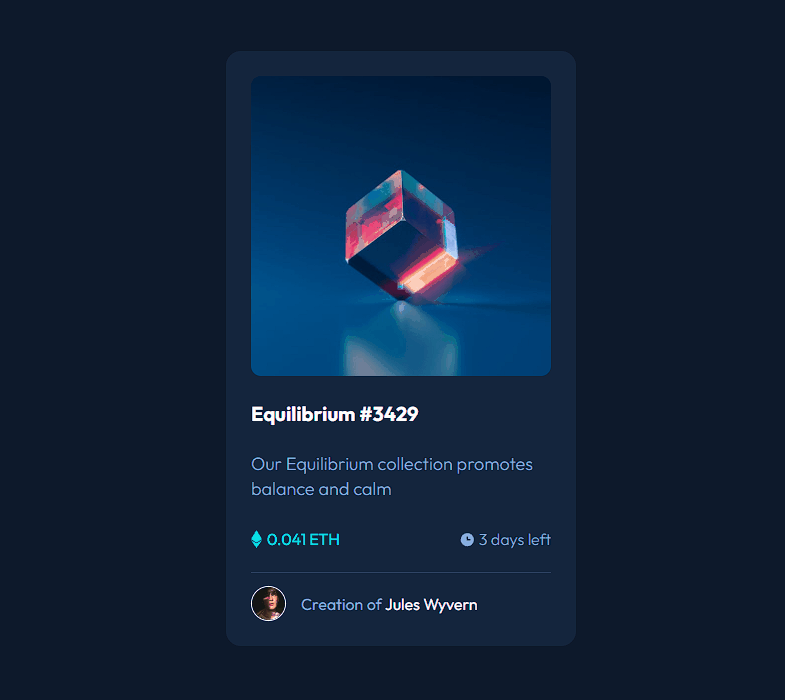

<h1 style="text-align: center;">Projeto Card NFT </h1>
    

## Sobre
- Este foi o meu primeiro projeto onde testei minhas habilidades e dominâncias sobre Html e Css.
- Apesar das dúvidas e dificuldades consegui um resultado organizado e bem feito.

## Tecnologias Utilizadas 
- HTML 
- CSS

## Responsividade
- Para todos os tipos de dispositivos.
## Dificuldades deste projeto 
- Adquiri muitos aprendizados enquanto realizava este card, principalmente sobre os pseudoelementos "hover" e "before" que foram utilizados para criar esta sobreposição de tela na imagem.
- Outro desafio também envolvendo estes pseudoelementos, foi a inserção das imagens antes do valor ETH e amtes do "days left", onde eu precisei revisar minhas anotações e quebrar bastante a cabeça antes de obter um resultado satisfatório.

Link para o site em que peguei a ideia deste <a  target="_blank" href="https://www.frontendmentor.io/"> projeto</a>.
