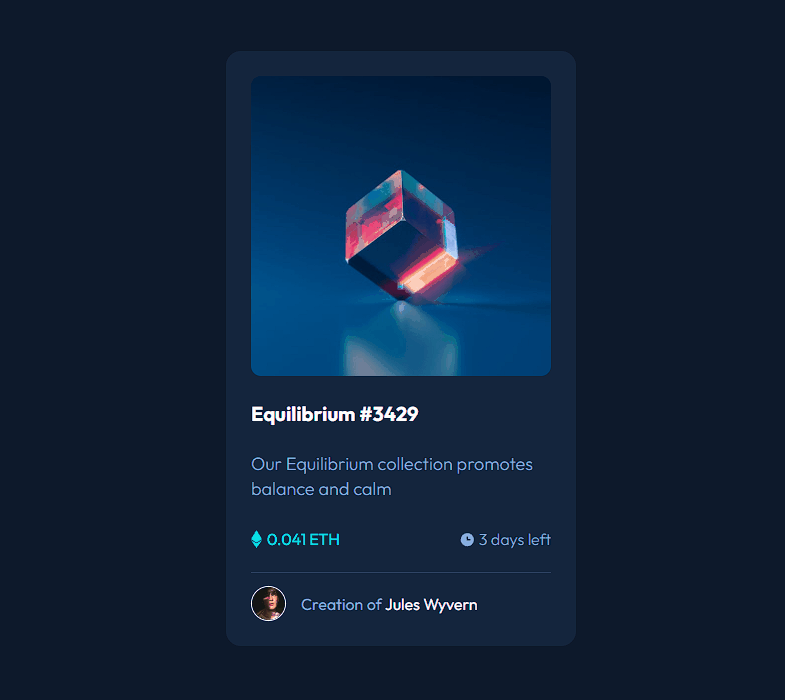

# Card NFT (HTML e CSS)



---

## Sobre o Projeto

Componente de **card NFT** desenvolvido utilizando **HTML e CSS**.
Este projeto foi criado com o objetivo de praticar conceitos fundamentais de **layout com Flexbox**, além de explorar efeitos visuais com pseudo-elementos.

Baseado em um desafio do **Frontend Mentor**.

---

##  Tecnologias Utilizadas


---

## Conceitos Aplicados

* Layout com Flexbox
* Pseudo-elementos (`::before`)
* Pseudo-classes (`:hover`)
* Organização de estilos com CSS
* Construção de componentes visuais

---

## Responsividade

O projeto foi desenvolvido para **diferentes tamanhos de tela**,
adaptando-se a dispositivos desktop e mobile.

---

## Desafios Enfrentados

Durante o desenvolvimento, os principais desafios foram:

* Aplicar corretamente os pseudo-elementos para criar efeitos visuais
* Implementar o efeito de overlay na imagem utilizando `hover`
* Inserir ícones antes de informações como valor em ETH e tempo restante

Esses desafios foram importantes para aprofundar o conhecimento em **CSS avançado** e manipulação visual.

---

#  Como rodar o projeto

## 1. Clonar o repositório

```bash id="nft1a2"
git clone https://github.com/Arthurthedev/Projeto-NFT-Card-
```

---

## 2. Acessar a pasta do projeto

```bash id="nft3b4"
cd Projeto-NFT-Card-
```

---

## 3. Executar o projeto

Como é um projeto **100% frontend (HTML e CSS)**, você pode:

* Abrir o arquivo `index.html` diretamente no navegador
  ou
* Utilizar a extensão **Live Server** no VS Code

---

## 4. Acessar no navegador

Se estiver usando Live Server:

```id="nft5c6"
http://127.0.0.1:5500
```

---

## Autor

**Arthur Moraes Thurler**

* LinkedIn: https://www.linkedin.com/in/arthur-moraes-dev/
* GitHub: https://github.com/Arthurthedev
